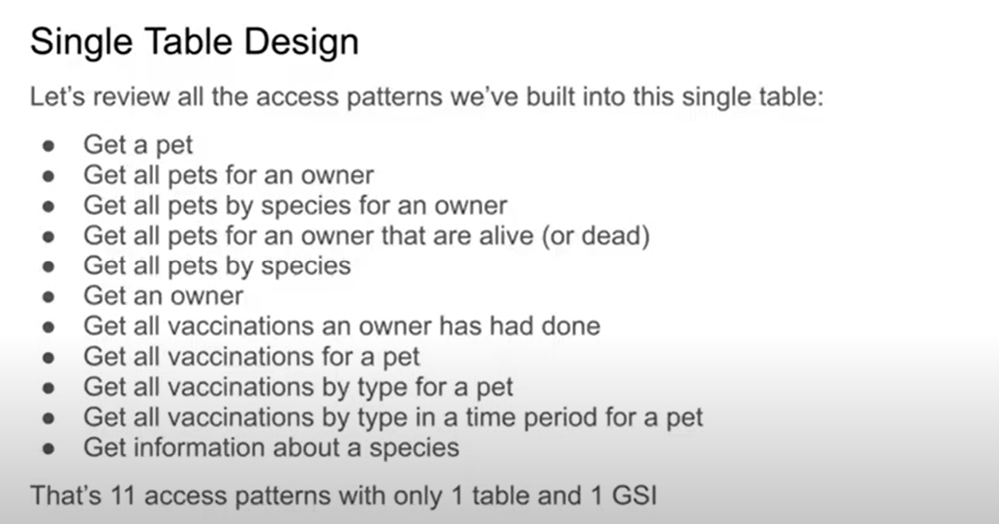
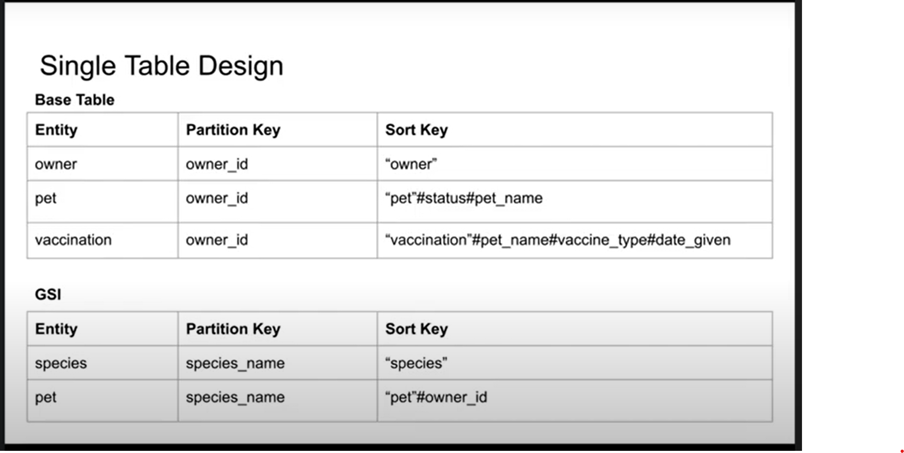

## NoSql
* A NoSQL (originally referring to "non SQL", "non relational" or "not only SQL") database provides a mechanism for storage and retrieval of data which is modeled in means other than the tabular relations used in relational databases. ... NoSQL databases are increasingly used in big data and real-time web applications

## Motivation
* Simplicity of design
* Simpler horizontal scaling
* Finer control over availability

## Data Structures
* key-value
* wide column
* graph
* document

* Sample dynamodb design for pets using access design pattern
  * 
  * 

* Access pattern
  * [info](https://www.youtube.com/watch?v=lltYSnUQ_ik&t=398s)
  * High and elastic throughput (especially for writes)
    * RDBMS uses locks and latches for ACID
    * NO SQL usuallly lock free and uses quorams for read/write and much simpler transactional concurrency rules(often based on Optimistic Concurrency). Paring with sharding/data distribution they can achieve much and more importantly near linear scalability and better elasticity.
  * Hierachical data (Data stores)
    * Many data design patterns can be easily converted to documented data stores and optimized for reads without join(Embedding)
    * For referential integrity we can still use referencing.
    * Denormalizing Data is OK for optimizing reads in NOSQL
  * Fluid Schema
    * Responding schema changes in RDBMS over time is challenging
    * NO SQL flexible schema design allows for much faster application development and co existane of multiple schema versions.
  * Micro services/Event driven Data stores
    * Most of micro services/event driven datastore architectures use JSON format for message which natually fit for better NOSQL and better serve for API driven NOSQLs.
* NO SQL design principles and best practices.
  * (BASE) **B**asic **A**vailability and **S**oft sate, **E**eventual consistency
* Duplication and Denormalization are accepteable (and encouraged)
* Design encourages hierarhical data instead of splitting out elements that later joined.
* Use document "type" discriminator to different document data types.
* Partitioning/Sharding your data horizontal and flexible scalabiliy(combine with "type" attribute allow to co-locate different type of documents which share same Partition key. )