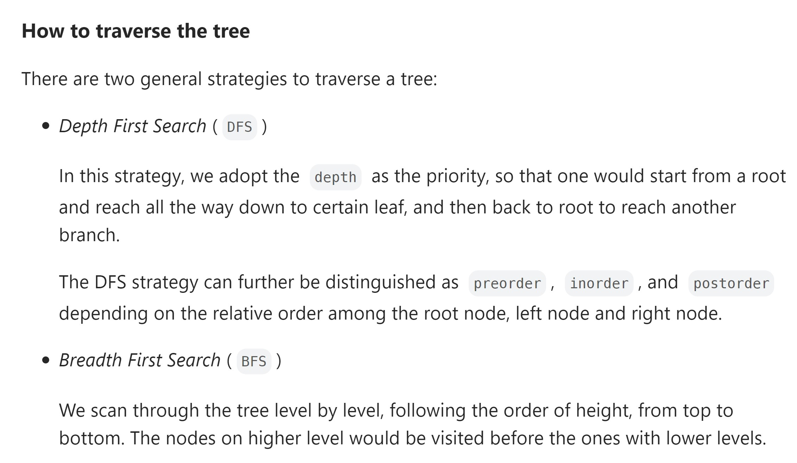
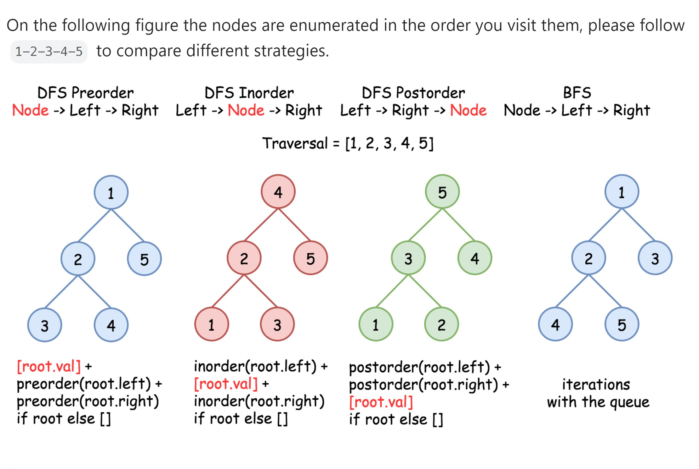

* pre order
  * root, left, right
* in order
  * left, root, right
  * easy to represent the mathematical expression
* post order
  * left, right, root
  * used in mathematical
  * easy to calcualate the expression
  * to delete the tree.
  * If you handle this tree in postorder, you can easily handle the expression using a stack. Each time when you meet a operator, you can just pop 2 elements from the stack, calculate the result and push the result back into the stack.

  * Traversing Tree
  
  