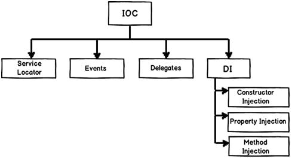

[IOC/DI](https://stackoverflow.com/questions/6550700/inversion-of-control-vs-dependency-injection)
* Library vs Framework
    * Inversion of Control is a key part of what makes a framework different to a library. 
   A library is essentially a set of functions that you can call, these days usually organized into classes. Each call does some work and returns control to the client.

## IOC vs DI

[source](https://www.codeproject.com/Articles/592372/Dependency-Injection-DI-vs-Inversion-of-Control-IO)

