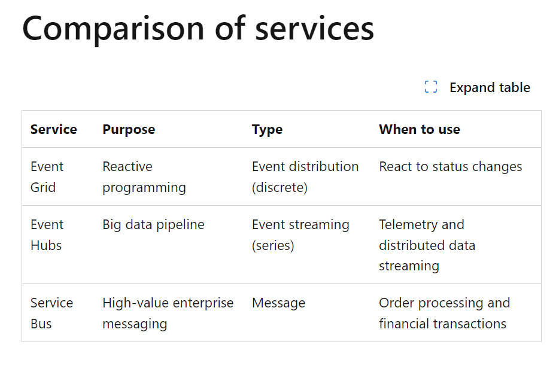

* **A**rchitectural **D**ecision **R**ecord
  * [adr](http://thinkrelevance.com/blog/2011/11/15/documenting-architecture-decisions)
    * Context and Problem statement
    * Considered Options
      * Pros and Cons
    * Decision drivers
    * Decision Outcome
    * Links
  
* [Event Hub/Event Grid/Service Bus](https://learn.microsoft.com/en-us/azure/service-bus-messaging/compare-messaging-services)
  
* [12 factor app](https://12factor.net/)
* [odata filtering](http://docs.oasis-open.org/odata/odata/v4.01/odata-v4.01-part2-url-conventions.html#sec_SystemQueryOptionfilter)
* [odata .net libs](https://learn.microsoft.com/en-us/dotnet/api/overview/odata-dotnet/)
* [odata cosmos](https://devblogs.microsoft.com/odata/integrating-cosmos-db-with-odata-part-1/)
* [odata cognitive search](https://learn.microsoft.com/en-us/azure/search/query-odata-filter-orderby-syntax)
* Backend for Front End
  * Backend for Frontend (BFF) is an architectural pattern that is commonly used in web development to improve the performance, maintainability, and flexibility of frontend applications 1. It involves creating a dedicated backend service specifically tailored to meet the needs of a particular frontend application 1. The BFF pattern is useful when you want to avoid customizing a single backend for multiple interfaces 2.
  * [medium](https://medium.com/@mohan.velegacherla/what-is-backend-for-frontend-bff-and-how-it-protects-your-apis-39e315d3fc3d)
  * [azure](https://learn.microsoft.com/en-us/azure/architecture/patterns/backends-for-frontends)