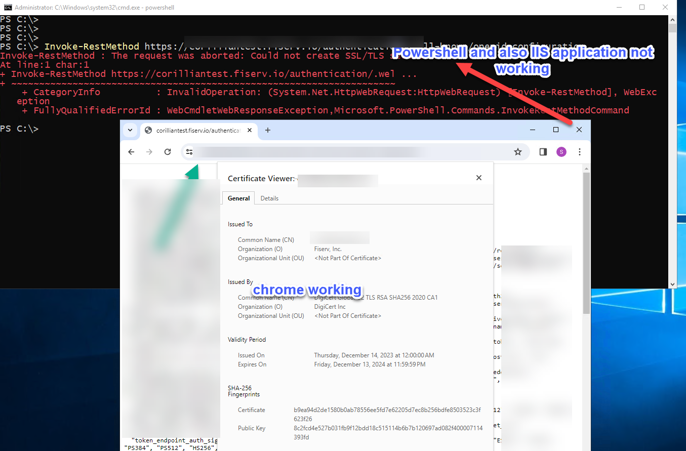
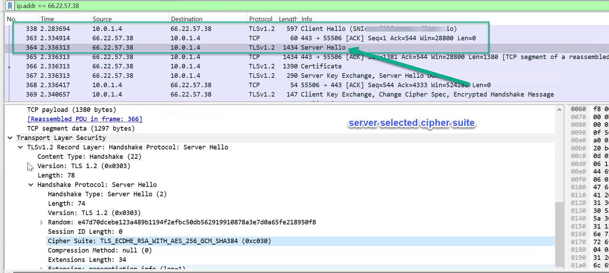
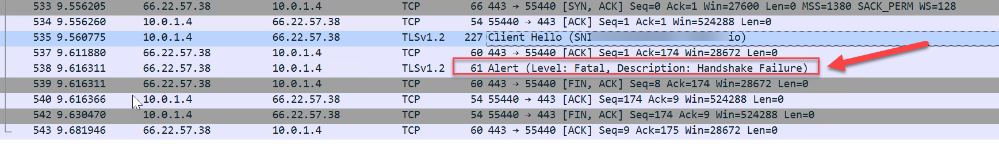
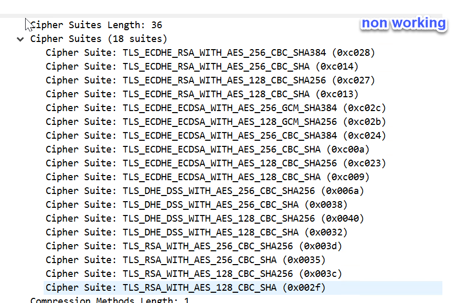
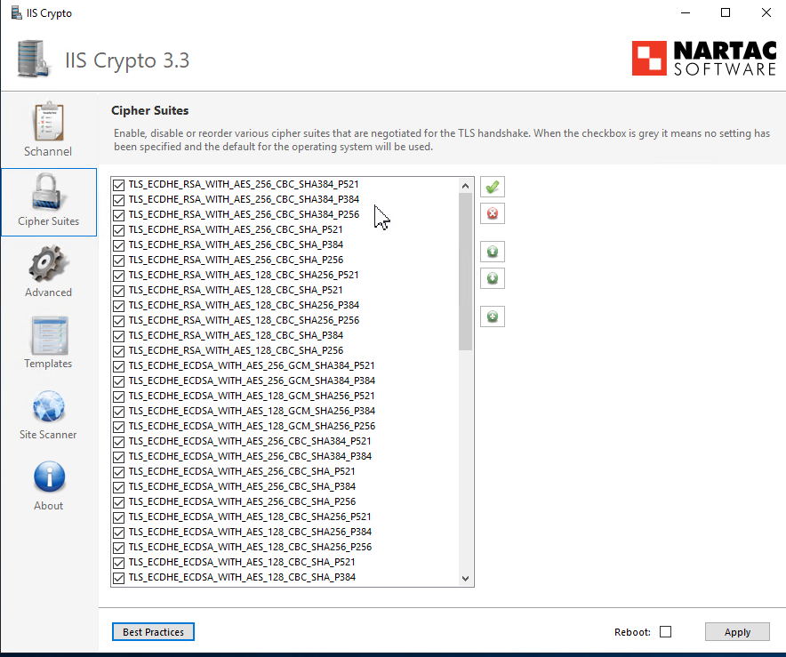
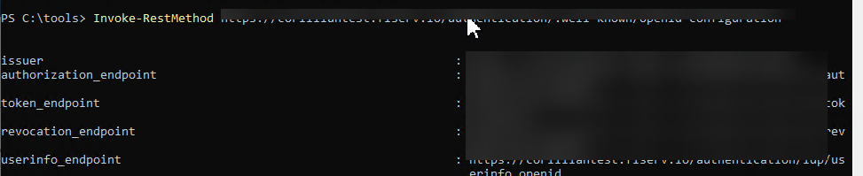

## Context
While testing Unified Login integration POC , Azure box is giving SSL error, when getting configuration from OAuth2 server programmatically. The same URL works when browsed through google chrome.



## Details
* The certificate seems to be ok when browsed through chrome
* The URL [well-known/openidconfiguration](https://corilliantest.fiserv.io/authentication/.well-known/openid-configuration) works through chrome
* The same URL does not work through powershell scripts

## Steps

Here are the steps to debug using Wireshark

* Install WireShark
* Get the ip address of _corilliantest.fiserv.io_
* Use the filter in WireShark
* Run through Chrome browser (_working_)
  * Capture the WireShark
    
  * __ServerHello__ follows __ClientHello__
  ___
* Run the application (or powershell Invoke-RestMethod) 
  * Capture the wire shark
    
    ___
    * __ServerHello__ missing.
    * **Missing TLS_ECDHE_RSA_WITH_AES_256_GCM_SHA384**
    
    
  ___
* Verifying through powershell
  * Get Current Tls Cipher suite
    ```powershell
        Get-TlsCipherSuite | % { $_.Name } | out-file c:\temp\test1.txt
    ``` 
  * Enable Cipher suite
    ```
        Enable-TlsCipherSuite -Name TLS_ECDHE_RSA_WITH_AES_256_CBC_SHA384
    ```
  * Optionally use the tool https://www.nartac.com/Products/IISCrypto/Download which has more features to show the details.
    * 

___

## Result
  * Powershell works now when browsing
    

___

## Why Chrome works

**Does Chrome use Windows cipher suites?**

It is important to note that if you can often connect to services with Chrome when other applications fail. This is because **Chrome implements its own version of the Cipher suites**, so it is not dependent on what the OS is capable of.