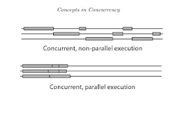

you can’t improve what you don’t measure
_____________________________
* Concurrency is not Parallelism
  * Concurrency is when two or more tasks can start, run, and complete in overlapping time periods. It doesn't necessarily mean they'll ever both be running at the same instant. For example, multitasking on a single-core machine. Parallelism is when tasks literally run at the same time, e.g., on a multicore processor
  * Parallelism is doing more than one thing at the same time, concurrency is doing something else while someone else performs a thing you are waiting for.
  * 
  * non-cpu-bounded process, it is a good idea to use asynchronous programming
  * async-await implementation
	 * IAsyncStateMachine 
  * resources
    * [async-await](https://itnext.io/async-await-what-happens-under-the-hood-eef1de0dd881https://itnext.io/async-await-what-happens-under-the-hood-eef1de0dd881)
    * [async-await picture](https://tooslowexception.com/net-asyncawait-in-a-single-picture/)
	* [no-thread](https://blog.stephencleary.com/2013/11/there-is-no-thread.html)

______________________________________________________
	* .NET Standard
  * .NET Standard is a formal specification of .NET APIs that are available on multiple .NET implementations. The motivation behind .NET Standard was to establish greater uniformity in the .NET ecosystem. .NET 5 and later versions adopt a different approach to establishing uniformity that eliminates the need for .NET Standard in most scenarios. However, if you want to share code between .NET Framework and any other .NET implementation, such as .NET Core, your library should target .NET Standard 2.0. No new versions of .NET Standard will be released, but .NET 5, .NET 6, and all future versions will continue to support .NET Standard 2.1 and earlier.
  * [more info](https://learn.microsoft.com/en-us/dotnet/standard/net-standard?tabs=net-standard-1-0)
  
______________________________________________________

* Cyclomatic Code complexity
  * is a metric that indicates the possible number of paths inside a code artifact.
    * For instance, a function with a cyclomatic complexity of 1 will always go through the same execution path. Conversely, a function with a cyclomatic complexity value of 8 will have eight possible execution paths.
	* [here](https://linearb.io/blog/cyclomatic-complexity
	* Formula : E-N+2P
	  * E - edges, N nodes P exits
	  * Each statement is Node
	  * Edge is connecting the statements
    * Related to Testing
      * The more possible execution branches a given piece of code has, the more test cases you’ll need to ensure that all possibilities are covered	
	* 1-10 low
	* 11-20 moderate
	* 21-50 High
	* 51+ Very high

* Maintainability Index
  * Halstead's volumne -HV
  * Cyclomatic complexity
  * Lines of Code - LOC
  * % of Comments - perCOM
  
* Class coupling
  * Measure of how many classes a single class uses.
  * Should have high cohesion and low coupling
  * Optimal value is: 9

* Depth of Inheritance
  * Depth of inheritance tree (DIT) is a code metric that is specific to object-oriented programming. It measures the maximum length between a node and the root node in a class hierarchy.
* Cognitive complexity
  * how complexly or simply people think about a particular issue
  * is a measure of how hard it is to understand a given piece of code—e.g., a function, a class, et
  * [here](https://linearb.io/blog/cognitive-complexity-in-software)
  * Causes
     * Cyclomatic Complexity
	 * Poor naming
	 * Poor architectural decisions
	 * Large functions or classes.
	 * High essential complexity
	 * Not following established conventions
	 * Lack of familiarity with the domain.
	 * Lack of familiarity with language or stack
	 
* Software Quality measures
  * LOC (lines of code)
  * Cyclomatic compelxity (Control flow metrics)
	  
* Code Churn.
  * What Is Code Churn? Code churn (also interchangeably known as rework) is a metric that indicates how often a given piece of code—e.g., a file, a class, a function—gets edited. As you'll soon see, if a given piece of code receives changes too often, that's usually a bad sign.
  
_____________________________