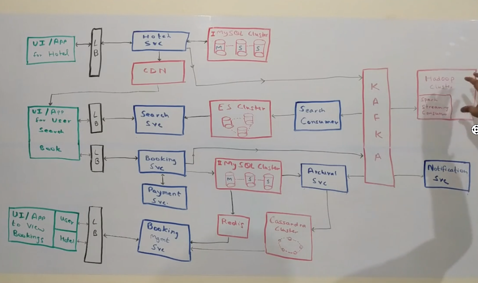

# Overview

## DB decision

* Structured
  * ACID
    * SQL server, Oracle, My Sql, PostGress
* Non structured
  * ex: Catalog (lot of different attributes)
  * Need to have queries
  * Document Db
    * Mango DB, Couch
* Ever incrasing Data wit finite queries
  * Columnar DB
    * Casandra, HBase

## Steps

* Devide in to Functional Requirements and Non Functioal requirements

## URL shortening

* FR
  * Get Short URL
  * Redirect to Long URL
* NR
  * Low latency
  * High availability

* Questions to ask?
  * How much traffic?
  * What are number of urls expected?
  * How long we should support?
* Gather requirements
  * Lets x number of requests to generarte
    * x*60*60*24*356*10 (10 years we are keeping them)
  * Character set to include in short url
    * [a-z][A-Z][0-9]
  * size
    * 1 char -> 62 url
    * 2 char -> 62^2
    * 3      -> 62^3
    * 62^n > (x*60*60*24*10 = y)
    * 62^n = y
    * nlog62 = y
* Potential architecture
  * come up with initial block diagaram
  * no single point of failure.
  * introduce a token service which gives range to each application service. Token service can use sql backend. ex: service1 gets 1-1000 and service2 gets 1001-2000
  * service1 gets range and start converting to base 62
  * adding metrics
  * introduce Kafka for analytics
    * asynchronosly
    * update in batch mode.

____

* Air B&B
  * Gather Functional and Non functional
  * Also gather scalability issues
  * FR
    * Hotel
      * Onboard
      * Updates
      * Booking
    * User
      * Search
      * Bookings
      * Check
    * Analytics
  * NF
    * Low latency
    * High Availability
    * High consistency
    * Scale
      * 500 k hotels
      * 10 M rooms
      * 1000 rooms/hotel
  * Look for high scale and low scale systems here. Hotel onboarding is not a high scale and also MySQL can be used in this case.
  * Use CDN for videos/images of the properties
  * Use Kafka for events.
  * Use Elastic search Cluster for search (supporting fuzzy search)
  * 
  * Need to get in to design API routes to the level of names
  * Need to get DB scheams
  * List the services
  * By using Relational SQL for low throughput DBs we can also use its ACID properties which makes easy to control multi users system.
  * we can use Redis expiration callbacks to do some jobs
    * For room we can mark as 'Reserved' and put a message in redis with expiration
    * On expiration if room is not moved to 'Booked' we can assume that it is was cancelled and mark as 'Available' again.
  * Think of bifurcating the data based on region in situatinos like Air B&B , hotels.
  * Think of DR situations also.

____

## Amazon

* FL
  * Search
  * Cart/Wish List
  * Checkout
  * View orders
* NFL
  * Low latency
  * High availability
  * High Consistency
* Components
  * Services
    * Recommendation service
    * User service
    * Search service
    * Wish list service
    * Cart service
    * Servicability service
    * Order taking service
    * Inventory service
    * Order Processing service
    * Notification service
  * Kafka
    * Integrate supplier info.
    * Consumers
      * Search
      * Warehouse
  * Mango DB
    * Products and items are non structured.
  * Spark Streaming
  * Spark cluster
  * Hadoop cluster
  * Cassandra
  * My Sql
  * Elastic Search