* DRY
* KISS
* YAGNI
* SOLID
* Separation of Concern

[Layered architecture](https://github.com/aspnetrun/run-aspnetcore-basics)
[Layered architecture](https://github1.com/aspnetrun/run-aspnetcore-basics)

[Clean architecture](https://github.com/aspnetrun/run-aspnetcore-realworld)
[Clean architecture](https://github1.com/aspnetrun/run-aspnetcore-realworld)

* Strong Consistency is Mandatory && Independent Scale and Deploy is not required = MOdular Monolithic
* Strong Consistency is not Mandatory, Eventual Consistency is OK && Indepdnet Scale and Deploy is Required = Microservices

[Modular Monolithic with DDD](https://github.com/kgrzybek/modular-monolithic-with-ddd)
[Modular Monolithic with DDD](https://github1s.com/kgrzybek/modular-monolithic-with-ddd)

[Martin Fowler](https://martinfowler.com/articles/microservices.html)

* Microservices
  * Decomposition
  * Communication
  * Data Management
  * Transaction Management
  * Deployments
  * Resilience

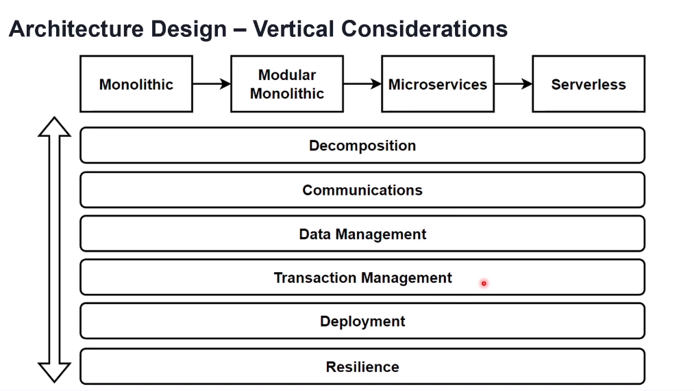

* Microservices Decompostion Patterns
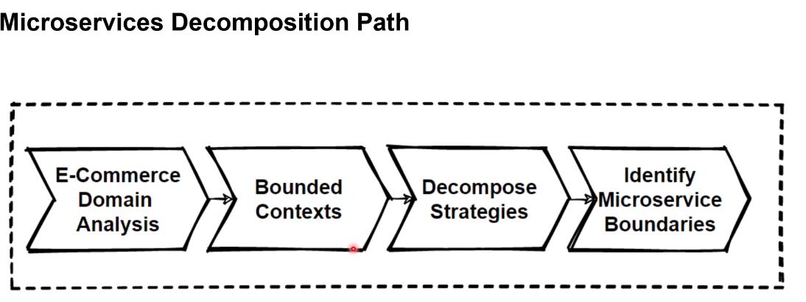
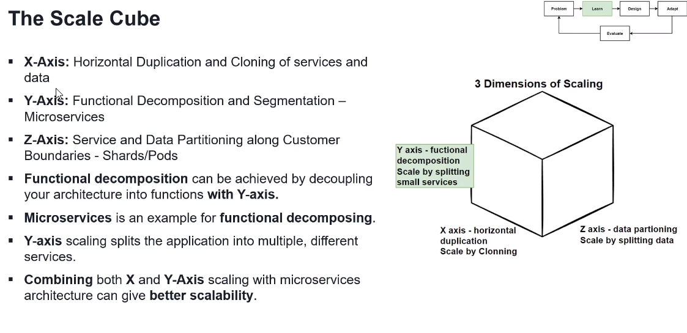

  * By Business Capability
  * By Sub domain
  * Bounded context pattern
    * 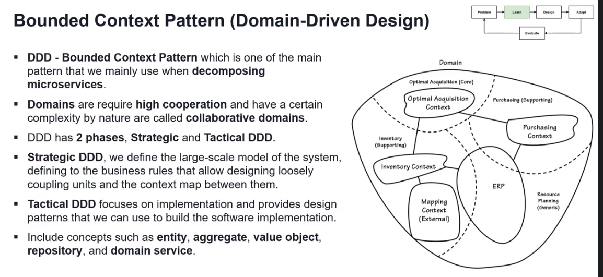
    * Bounded context is the logical boundary that represents the smaller problem particles of the complex domain that are self consistent and as independent as possible.
    * Identity bounded context boundaries
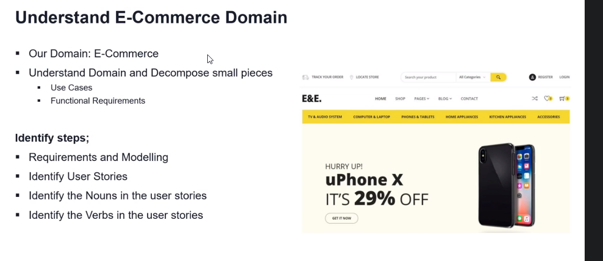
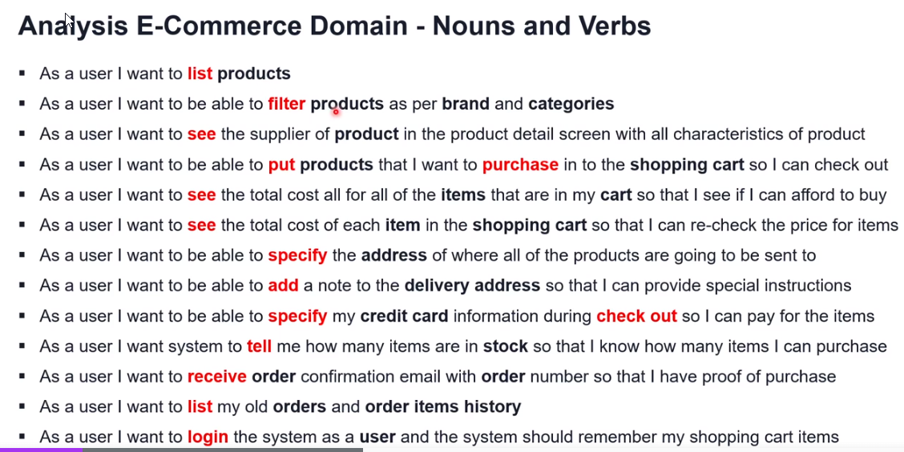
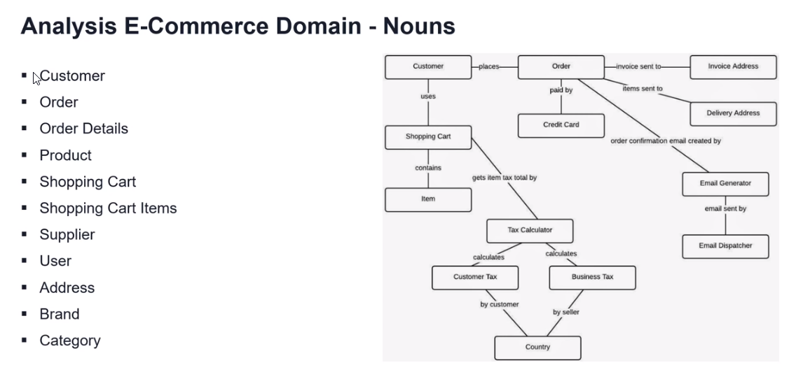
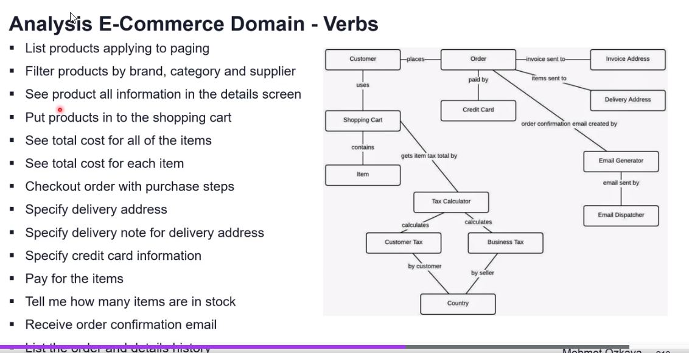
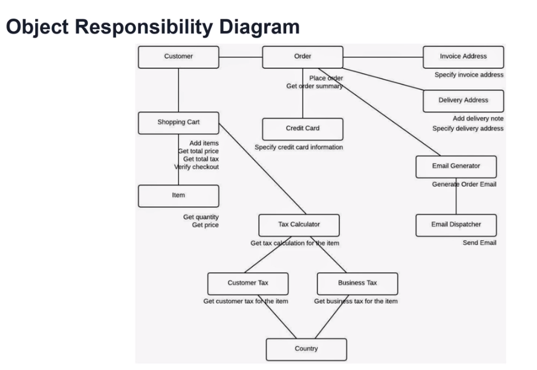
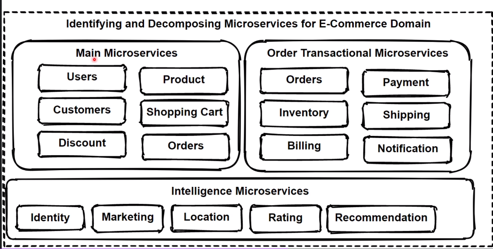
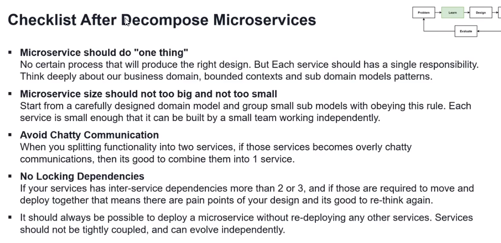
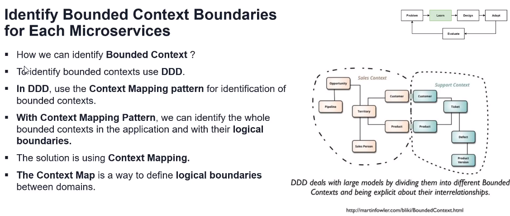

* Smart endpoints and dump pipes: microservices loosely coupling and expose endpoints with RESTFul APIs in order to provide end-end-end use cases.

* Cross cutting 
  * Authentication
  * Authorization
  * Rate Limiting
  * SSL Certification
  * Logging Monitoring
  * Load balancing
  * Circuit breaker

* Gateway Patterns
  * Routing pattern (layer 7 routing)
    * requests to multiple microservices
  * Aggreation pattern
  * Offloading pattern
    * Rate limit
    * Circuit breaker
    * Load balancing
    * Authentication
    * Authorization
    * Token mangement
    * SSL certificate
    * Protocol conversion

* Backends for Frontends Pattern (BFF) (aka Channel specific)
* Service Aggregator Pattern
* Service Registry/Discovery Pattern
  * Netflix Eureka
  * Kubernetes container orchestrator automatically handle service dicovery operations.
* Types of Async Message based Communications
  * Single receiver (one-to-one (message))
    * Command pattern
  * Multi receiver (one-to-many (topic)/ pub/sub)
    * Kafka
    * RabbitMQ
    * Amazon SNS
    * Event Bridge
* Data Management
  * Choosing Right database
  * Commands and Queries
  * Distributed transactions
  * Patterns
    * The database-per-Service pattern
    * The API Compostion pattern
    * The CQRS pattern
    * The Event Sourcing Pattern
    * The Saga Pattern
    * The Shared Database **anti** pattern
  * No-SQL
    * Document
      * Content management
      * Storing Catalogs
      * ex: Products
      * MongoDB, Cloudant
    * Key-value
      * Session oriented
      * Customer base data
      * Redis, Amazon DynamoDB, Azure CosmoDB, Orcale NoSQL Database.
    * Graph-based
      * fraud detection, socal networks, recommendation engines.
      * OrientDB, Neo4j, Amazon Neptune.
    * Column-based
      * Wide-Column database
      * Select Mostlysame columns, it is good to use this database.
      * Apache HBase ,Amazon DynamoDB, Azure CosmosDB

* When to use Relational Database
  * ACID
  * Predictable data
  * Low workload volumes
  * Read requirements , Complex join queries

* When to use No-SQL
  * Flexible schema, Dynamic data (Iot plaform, sensor data)
  * Un-predictable data, High workload volume
  * Frequenly change data and read requirement.
  * BASE model
    * Basically available,
    * Soft state
    * Eventually Consistent
    * Write performance requirements
    * Not good for complex join queries
    * Deployments, De-centralized structure
* General
  * store JSON documents in No-SQL document
  * Put tranasctional data in to Relational SQL
  * Use a time series database for telemetry databases
  * Choose Blob data storage for blob datas
  * Pub application logs in to Elastic Search databases.

* Cross-Service Queries with Sync Response, Decouple way and Low latency
  * Materialized view pattern
    * Maintain readonly data
  * CQRS Design Pattern
    * Separates read and write operations with separating databases.

